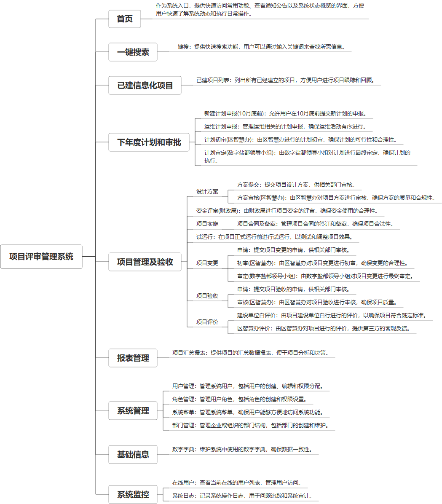

 

    
 

公司拥有上百套具有自主知识产权的软件系统，详情请查看码云首页或公司官网

 
<h1>项目申报评审系统</h1>

<a href="https://www.haishi.net.cn/">公司官网</a> ｜ <a href="https://www.haishi.net.cn/">在线体验</a>

 

## 系统介绍

项目申报评审系统是一个综合性的信息化管理平台，旨在规范和优化项目的申报、评审、执行与验收等全流程管理。该系统涵盖了从项目申报、初步设计、方案提交到最终的项目验收和评价等多个环节，通过用户管理和角色管理确保权限分配合理，同时提供了项目变更、资金评审、计划任务等功能以适应项目生命周期中的各种需求。系统还支持项目合同及备案、项目周期查询、维保项目查询等服务，为用户提供便捷的信息查询和管理工具。此外，该系统特别强调了对项目实施过程的监督和控制，如运行监控、项目验收申请填报及审核、建设单位自评价和区智慧办评价等，确保项目按计划高质量完成。整个系统设计严谨，功能全面，不仅有助于提高工作效率，还能有效促进各部门间的协同合作，是现代项目管理不可或缺的重要工具。
项目申报评审系统是一个综合性的信息化管理平台，旨在规范和优化项目的申报、评审、执行与验收等全流程管理。该系统涵盖了从项目申报、初步设计、方案提交到最终的项目验收和评价等多个环节，通过用户管理和角色管理确保权限分配合理，同时提供了项目变更、资金评审、计划任务等功能以适应项目生命周期中的各种需求。系统还支持项目合同及备案、项目周期查询、维保项目查询等服务，为用户提供便捷的信息查询和管理工具。此外，该系统特别强调了对项目实施过程的监督和控制，如运行监控、项目验收申请填报及审核、建设单位自评价和区智慧办评价等，确保项目按计划高质量完成。整个系统设计严谨，功能全面，不仅有助于提高工作效率，还能有效促进各部门间的协同合作，是现代项目管理不可或缺的重要工具。
本项目名称为项目评审管理系统，旨在实现对项目从计划申报、方案设计、资金评审、合同备案、变更管理、试运行、验收评价以及最终报表统计的全生命周期管理。系统提供一键搜索功能，方便用户快速查找项目信息。系统还包含系统监控模块，可以监控在线用户和系统日志，保障系统安全稳定运行。
                

## 系统功能介绍

### 系统包含终端说明

管理端（WEB）

| 序号 | 模块 | 模块说明 |
| --- | --- | --- |
| 1 | ZF-PMS-PSXT-SERVER | 服务端 |

### 系统功能结构

### 系统功能说明

系统主要功能模块：
- 登录系统：用户登录系统入口。
- 首页：系统首页，提供项目概览等信息。
- 一键搜索：快速搜索项目信息。
- 已建项目列表：展示已建项目列表。
- 下年度计划和审批：包括新建计划申报、运维计划申报、计划初审和计划审定。
- 项目管理及验收：涵盖设计方案、资金评审、项目合同及备案、项目变更、试运行、项目验收和项目评价等功能。
- 报表管理：提供项目汇总报表。
- 系统监控：监控在线用户和系统日志。
- 系统管理：包括用户管理、角色管理、系统菜单和部门管理。
几个重要的功能：
1. 项目全生命周期管理：系统覆盖了项目从计划申报到验收评价的全过程，实现了对项目信息的集中管理。
2. 一键搜索：方便用户快速查找项目信息，提高工作效率。
3. 项目变更管理：支持项目变更申请、初审和审定，方便对项目进行动态管理。
4. 项目评价：支持建设单位自评价和区智慧办评价，多维度评估项目成果。
5. 系统监控：保障系统安全稳定运行。

## 系统主要界面

## 系统技术说明

### 代码模块说明

| 序号 | 目录 | 目录说明 |
| --- | --- | --- |
| 1 | ZF-PMS-PSXT-SERVER/.idea | -- |
| 2 | ZF-PMS-PSXT-SERVER/src | -- |

### 系统技术选型

#### 开发语言/框架

JAVA（JDK1.8）
前端框架：VUE2
框架：SpringBoot2.x

#### 服务中间件

Tomcat

#### 数据库

MySQL（5.7+）
Redis

#### 其他说明

无

## 系统演示/商用

请扫码添加客服微信获取演示地址和系统详细资料。

如果您想基于项目申报评审系统进行商业化交付或定制开发服务，我们提供有偿的技术服务支持，合作模式不限，欢迎沟通！

公司官网地址： <a href="https://www.haishi.net.cn/">https://www.haishi.net.cn</a>

联系客服获取专业回答。

## 使用须知

1、 本项目商用必须获得版权所有者的授权。

2、 未经允许本项目代码不允许二次出售。

